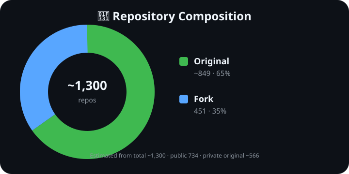

# 🌱 bonsai — Stats Profile

> Media Artist · Saitama, Japan · good vibes only
>
> 📈 このページは **統計データ** のプロフィール。作品の意味・物語（セマンティクス）は
> **[🎨 Portfolio](https://bonsai.github.io/bonsai/)** へ。

## 📁 3つのフォルダ

| Folder | 役割 |
|---|---|
| `docs/` | **Web / Portfolio** — GitHub Pages の公開物 |
| `data/` | **Data** — repo統計・活動データ |
| `scripts/` | **Generator** — 統計・HTML/SVG生成スクリプト |

> `README.md` はプロフィールの入口、`.github/` は自動更新ワークフロー。

## 📊 GitHub 統計

| 項目 | 数値 |
|---|---:|
| **総リポジトリ** | **約1,300** |
| 公開リポジトリ | **734** |
| ├ 公開オリジナル | **283** |
| └ 公開フォーク | **451** |
| **非公開オリジナル** | **約566** |
| **オリジナル合計** | **約849** |
| フォーク合計 | **451** |
| GitHub 歴 | **18+ 年** (2008〜) |

> ※ 総数約1,300を基準に、公開734との差分約566を非公開オリジナルとして集計。

## 🌱 直近 3 ヶ月の活動

| 指標 | 値 |
|---|---:|
| コントリビューション | **4615** |
| アクティブ日 | **85 / 91 日** |
| プッシュ頻度 | ほぼ毎日 |

## 🛠️ 使用言語（公開オリジナル 283 リポジトリ）

| 言語 | 数 | 割合 | 分布 |
|---|---:|---:|---|
| HTML | 51 | 24% | `██████████████████` |
| Python | 44 | 21% | `███████████████▌░░` |
| JavaScript | 31 | 15% | `███████████░░░░░░░` |
| TypeScript | 30 | 14% | `██████████▋░░░░░░░` |
| Go | 12 | 6% | `████▎░░░░░░░░░░░░░` |
| PowerShell | 11 | 5% | `███▉░░░░░░░░░░░░░░░` |
| Shell | 4 | 2% | `█▍░░░░░░░░░░░░░░░░░` |
| Java | 3 | 1% | `█░░░░░░░░░░░░░░░░░░░` |

*Stats profile · 作品の物語は [Portfolio](https://bonsai.github.io/bonsai/) · [ko-fi](https://ko-fi.com/v0n5ai)*
