# 🌱 bonsai — Stats Profile

> Media Artist · Saitama, Japan · good vibes only
>
> 📈 このページは **統計データ** のプロフィール。作品の意味・物語（セマンティクス）は
> **[🎨 Portfolio](https://bonsai.github.io/bonsai/)** へ。

## 📊 GitHub 統計

| 項目 | 数値 |
|---|---:|
| 公開リポジトリ | **722** |
| オリジナル | **276** |
| フォーク | **446** |
| GitHub 歴 | **18+ 年** (2008〜) |

## 🌱 直近 3 ヶ月の活動

| 指標 | 値 |
|---|---:|
| コントリビューション | **3691** |
| アクティブ日 | **86 / 91 日** |
| プッシュ頻度 | ほぼ毎日 |

## 🛠️ 使用言語（オリジナル 276 リポジトリ）

| 言語 | 数 | 割合 | 分布 |
|---|---:|---:|---|
| HTML | 52 | 24% | `██████████████████` |
| Python | 44 | 20% | `███████████████▎░░` |
| JavaScript | 32 | 15% | `███████████▏░░░░░░` |
| TypeScript | 31 | 14% | `██████████▊░░░░░░░` |
| PowerShell | 11 | 5% | `███▊░░░░░░░░░░░░░░` |
| Go | 11 | 5% | `███▊░░░░░░░░░░░░░░` |
| Jupyter Notebook | 4 | 2% | `█▍░░░░░░░░░░░░░░░░` |
| Java | 3 | 1% | `█░░░░░░░░░░░░░░░░░` |

*Stats profile · 作品の物語は [Portfolio](https://bonsai.github.io/bonsai/) · [ko-fi](https://ko-fi.com/v0n5ai)*
